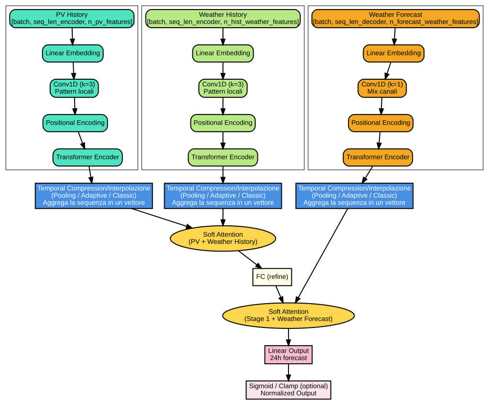

# 24-Hour Ahead Photovoltaic Power Forecasting


A deep learning system for day-ahead photovoltaic (PV) power generation forecasting using historical production data and meteorological observations.

## Table of Contents

1. [Introduction](#1-introduction)
2. [Project Overview](#2-project-overview)
3. [Dataset Description](#3-dataset-description)
   - 3.1 [Raw Data Sources](#31-raw-data-sources)
   - 3.2 [Data Merging and Alignment](#32-data-merging-and-alignment)
   - 3.3 [Processed Dataset](#33-processed-dataset)
4. [Feature Engineering](#4-feature-engineering)
   - 4.1 [Temporal Features](#41-temporal-features)
   - 4.2 [Lag Features](#42-lag-features)
   - 4.3 [Rolling Statistics](#43-rolling-statistics)
   - 4.4 [Solar Position Features](#44-solar-position-features)
   - 4.5 [Clear-Sky Irradiance](#45-clear-sky-irradiance)
   - 4.6 [Weather Description Encoding](#46-weather-description-encoding)
5. [Model Architecture](#5-model-architecture)
   - 5.1 [Multi-Branch Transformer](#51-multi-branch-transformer)
   - 5.2 [Branch Design Rationale](#52-branch-design-rationale)
   - 5.3 [Hierarchical Fusion Strategy](#53-hierarchical-fusion-strategy)
   - 5.4 [Hyperparameters](#54-hyperparameters)
6. [Ensemble Methodology](#6-ensemble-methodology)
   - 6.1 [Model Diversity](#61-model-diversity)
   - 6.2 [Ensemble Techniques](#62-ensemble-techniques)
   - 6.3 [Stacking with Ridge Regression](#63-stacking-with-ridge-regression)
7. [Training Pipeline](#7-training-pipeline)
   - 7.1 [Data Split Strategy](#71-data-split-strategy)
   - 7.2 [Preprocessing](#72-preprocessing)
   - 7.3 [Model Training](#73-model-training)
   - 7.4 [Ensemble Creation](#74-ensemble-creation)
8. [Evaluation Metrics](#8-evaluation-metrics)
   - 8.1 [MASE (Mean Absolute Scaled Error)](#81-mase-mean-absolute-scaled-error)
   - 8.2 [RMSE (Root Mean Squared Error)](#82-rmse-root-mean-squared-error)
   - 8.3 [Additional Metrics](#83-additional-metrics)
9. [Results](#9-results)
10. [Installation and Setup](#10-installation-and-setup)
11. [Usage Guide](#11-usage-guide)
    - 11.1 [Data Preprocessing](#111-data-preprocessing)
    - 11.2 [Training Models](#112-training-models)
    - 11.3 [Creating Ensemble](#113-creating-ensemble)
    - 11.4 [Evaluation on Test Set](#114-evaluation-on-test-set)
12. [Project Structure](#12-project-structure)
13. [Reproducibility](#13-reproducibility)
14. [License](#14-license)
15. [Author](#15-author)

---

## 1. Introduction

Accurate forecasting of photovoltaic power generation is essential for efficient grid management, energy storage optimization, and renewable energy integration. This project implements a deep learning approach for 24-hour ahead PV power forecasting, combining multiple neural network architectures through ensemble methods to achieve robust predictions.

The system addresses the challenge of predicting solar power output across all 24 forecast horizons while maintaining consistent accuracy, particularly during peak generation hours when prediction accuracy is most critical for grid operations.

---

## 2. Project Overview

**Objective**: Predict PV power generation for the next 24 hours using historical production data and weather observations.

**Key Characteristics**:
- Multi-step forecasting: Simultaneous prediction of 24 hourly values
- Multi-branch architecture: Separate processing pathways for different data types
- Ensemble approach: Combination of multiple model variants using stacking
- Physics-informed features: Solar position and clear-sky irradiance calculations

**Final Performance** (on held-out test set):
| Metric | Value |
|--------|-------|
| MASE | 0.478 |
| RMSE | 3.60 kW |
| MAE | 1.98 kW |
| R-squared | 0.963 |

---

## 3. Dataset Description

### 3.1 Raw Data Sources

The project uses two years of data (2010-2012) from a solar installation in Australia.

**PV Production Data** (`data/raw/pv_dataset.xlsx`):
- Format: Multi-sheet Excel file (two sheets covering different periods)
- Columns: `timestamp`, `pv`
- Timestamps: Local time (Australia/Sydney), naive (no timezone information)
- PV values: Power output in kW (peak capacity: 82.41 kWp)
- Total records: 17,542 hourly measurements

**Weather Data** (`data/raw/wx_dataset.xlsx`):
- Format: Multi-sheet Excel file (two sheets covering different periods)
- Columns: 14 meteorological variables
- Timestamps: UTC-aware with explicit timezone offset (+10:00)
- Total records: 17,544 hourly observations

Weather variables include:
| Variable | Unit | Description |
|----------|------|-------------|
| temp | K | Air temperature |
| dew_point | K | Dew point temperature |
| pressure | hPa | Atmospheric pressure |
| humidity | % | Relative humidity (0-100) |
| wind_speed | m/s | Wind speed |
| wind_deg | degrees | Wind direction (0-360) |
| rain_1h | mm | Precipitation in last hour |
| clouds | % | Cloud cover (0-100) |
| ghi | W/m2 | Global Horizontal Irradiance |
| dni | W/m2 | Direct Normal Irradiance |
| dhi | W/m2 | Diffuse Horizontal Irradiance |
| weather_description | string | Textual weather condition |

### 3.2 Data Merging and Alignment

The merging process addresses several technical challenges:

**Timezone Alignment**:
- PV timestamps are localized to `Australia/Sydney` timezone
- Both datasets are converted to UTC for uniform alignment
- A fixed UTC offset (+10:00) is applied to avoid gaps caused by Daylight Saving Time transitions

**DST Handling**:
- Spring forward (missing hour): Handled with `nonexistent='shift_forward'`
- Fall back (ambiguous hour): Resolved with `ambiguous=False` (standard time assumed)

**Timestamp Precision**:
- PV data contains millisecond precision timestamps
- Weather data uses exact hourly timestamps
- Forward-fill is applied to align weather observations with PV timestamps

**Validation**: The correlation between PV output and GHI is 0.905, confirming correct temporal alignment.

### 3.3 Processed Dataset

**Location**: `data/processed/merged/pv_wx_combined.parquet`

**Characteristics**:
- Total samples: 17,544 hourly observations
- Period: June 30, 2010 to June 30, 2012 (2 years)
- Total features: 84 columns
- Format: Apache Parquet (optimized for fast loading)
- Completeness: 100% (NaN values filled during preprocessing)

---

## 4. Feature Engineering

The preprocessing pipeline transforms raw data into 84 engineered features organized into the following categories.

### 4.1 Temporal Features

Cyclical encoding of time to capture periodic patterns:

| Feature | Formula | Range |
|---------|---------|-------|
| hour_sin | sin(2 * pi * hour / 24) | [-1, 1] |
| hour_cos | cos(2 * pi * hour / 24) | [-1, 1] |
| doy_sin | sin(2 * pi * day_of_year / 365) | [-1, 1] |
| doy_cos | cos(2 * pi * day_of_year / 365) | [-1, 1] |

Calendar flags:
- `is_weekend`: Binary indicator for Saturday/Sunday
- `is_holiday`: Binary indicator for public holidays

### 4.2 Lag Features

Historical values at specific time offsets to capture autocorrelation:

**PV Lags**:
- `pv_lag1`: PV output 1 hour ago
- `pv_lag24`: PV output 24 hours ago (previous day, same hour)
- `pv_lag168`: PV output 168 hours ago (previous week, same hour)

**Irradiance Lags** (for GHI, DNI, DHI):
- `{var}_lag1`: Value 1 hour ago
- `{var}_lag24`: Value 24 hours ago
- `{var}_lag168`: Value 168 hours ago

**Weather Lags** (for temp, humidity, pressure, wind_speed, clouds):
- `{var}_lag1`: Value 1 hour ago
- `{var}_lag24`: Value 24 hours ago

### 4.3 Rolling Statistics

Aggregated statistics over sliding windows:

**Rolling Means**:
- `pv_roll3h`, `pv_roll6h`, `pv_roll24h`, `pv_roll168h`: Rolling mean of PV
- `ghi_roll3h`, `ghi_roll6h`: Rolling mean of GHI
- `dni_roll3h`, `dni_roll6h`: Rolling mean of DNI

**Rolling Variance**:
- `pv_roll3h_var`, `pv_roll6h_var`: Rolling variance of PV
- `ghi_roll3h_var`, `ghi_roll6h_var`: Rolling variance of GHI

### 4.4 Solar Position Features

Calculated using the `pvlib` library based on timestamp and site coordinates:

| Feature | Description | Range |
|---------|-------------|-------|
| sp_zenith | Solar zenith angle | 0-180 degrees |
| sp_azimuth | Solar azimuth angle | 0-360 degrees |

The solar zenith angle indicates the sun's position relative to vertical:
- 0 degrees: Sun directly overhead
- 90 degrees: Sun at horizon
- Greater than 90 degrees: Sun below horizon (nighttime)

### 4.5 Clear-Sky Irradiance

Theoretical maximum irradiance under cloudless conditions, computed using the Ineichen clear-sky model:

| Feature | Description |
|---------|-------------|
| cs_ghi | Clear-sky Global Horizontal Irradiance |
| cs_dni | Clear-sky Direct Normal Irradiance |
| cs_dhi | Clear-sky Diffuse Horizontal Irradiance |
| kc | Clearness index (GHI / cs_GHI) |

The clearness index (`kc`) indicates atmospheric transmittance:
- kc = 1.0: Perfectly clear sky
- kc < 1.0: Cloud or aerosol attenuation
- kc > 1.0: Possible cloud enhancement effect

### 4.6 Weather Description Encoding

The textual `weather_description` field is converted to 19 binary one-hot encoded features:

| Feature | Weather Condition |
|---------|-------------------|
| wx_broken_clouds | Broken clouds |
| wx_clear | Clear sky |
| wx_drizzle | Drizzle |
| wx_few_clouds | Few clouds |
| wx_fog | Fog |
| wx_haze | Haze |
| wx_heavy_rain | Heavy rain |
| wx_light_drizzle | Light drizzle |
| wx_light_rain | Light rain |
| wx_light_shower_rain | Light shower rain |
| wx_mist | Mist |
| wx_moderate_rain | Moderate rain |
| wx_overcast_clouds | Overcast clouds |
| wx_scattered_clouds | Scattered clouds |
| wx_shower_rain | Shower rain |
| wx_smoke | Smoke |
| wx_squalls | Squalls |
| wx_thunderstorm | Thunderstorm |
| wx_thunderstorm_rain | Thunderstorm with rain |

Each sample has exactly one of these features set to 1, with all others set to 0.

---

## 5. Model Architecture

### 5.1 Multi-Branch Transformer

The primary model is a Multi-Branch Transformer with hierarchical attention fusion, implemented in PyTorch Lightning.

**Architecture Overview**:



**Branch Specifications**:

| Branch | Input Sequence | Features | Purpose |
|--------|----------------|----------|---------|
| PV History | 24 hours | PV lags and rolling statistics | Capture autocorrelation patterns |
| Weather History | 24 hours | Historical meteorological observations | Provide weather context |
| Weather Forecast | 24 hours | Future weather features and one-hot encoding | Day-ahead weather information |

### 5.2 Branch Design Rationale

**Why Separate Branches?**

Different data sources exhibit fundamentally different temporal dynamics:

1. **PV production**: Strong diurnal patterns with weather-dependent autocorrelation. Yesterday's and last week's production at the same hour are highly predictive.

2. **Historical weather**: Provides context about recent atmospheric conditions but has different lag structures than PV output.

3. **Future weather forecasts**: Inherently different characteristics from historical observations (predictions vs. measurements). These features inform the model about expected conditions during the forecast period.

### 5.3 Hierarchical Fusion Strategy

The two-stage fusion mimics expert forecaster reasoning:

**Stage 1**: Fuse PV history with weather history
- Both are backward-looking signals
- Creates a unified representation of current conditions

**Stage 2**: Integrate fused history with future weather forecast
- Adjusts predictions based on expected conditions
- Enables adaptive weighting between historical patterns and forecast information

**Soft Attention Mechanism**:
- Learns optimal branch weights per sample (not fixed globally)
- Clear-sky days: Higher weight on PV autocorrelation
- Variable weather: Higher weight on meteorological forecasts

### 5.4 Hyperparameters

Default configuration used in training:

| Parameter | Value | Description |
|-----------|-------|-------------|
| d_model | 256 | Transformer embedding dimension |
| num_heads | 4 | Number of attention heads |
| num_layers | 2 | Transformer encoder layers |
| dropout | 0.2 | Dropout rate |
| learning_rate | 1e-4 | Initial learning rate |
| batch_size | 64 | Training batch size |
| seq_len | 24 | Input sequence length (hours) |
| horizon | 24 | Forecast horizon (hours) |

---

## 6. Ensemble Methodology

### 6.1 Model Diversity

The ensemble combines multiple model variants trained with different configurations:

**Configuration Variants**:
- Different random seeds for weight initialization
- Different temporal compression methods (pooling, adaptive, classic)
- Different training/validation splits

Model diversity ensures that individual model errors are less correlated, improving ensemble robustness.

### 6.2 Ensemble Techniques

Four ensemble methods are implemented:

1. **Simple Average**: Unweighted mean of all model predictions
2. **Weighted Average**: Weights inversely proportional to individual model MASE
3. **Median Ensemble**: Median of predictions (robust to outliers)
4. **Stacking (Ridge Regression)**: Meta-learner trained on model predictions

### 6.3 Stacking with Ridge Regression

The stacking approach treats individual model predictions as features for a meta-learner:

**Training Process**:
1. Generate predictions from all base models on training data
2. Split predictions: first half for training Ridge regressor, second half for validation
3. Train Ridge regression with L2 regularization (alpha=1.0)
4. Apply trained weights to generate final predictions

**Mathematical Formulation**:
```
y_ensemble = w_0 + w_1 * pred_1 + w_2 * pred_2 + ... + w_n * pred_n
```

Where `w_0` is the intercept and `w_i` are learned coefficients for each model.

**Advantages**:
- Learns optimal combination weights from data
- Can correct for systematic biases in individual models
- Includes intercept term for bias correction

---

## 7. Training Pipeline

### 7.1 Data Split Strategy

Chronological split to prevent data leakage:

```
Dataset: 17,544 hours
|
+-- Training Set (90%): First 15,790 samples
|   Period: 2010-06-30 to 2012-04-30
|   Purpose: Model parameter learning
|
+-- Validation Set (10%): Last 1,754 samples
    Period: 2012-04-30 to 2012-06-30
    Purpose: Early stopping and model selection
```

**Important**: No shuffling is performed. Time series integrity is maintained throughout.

For test evaluation, a separate held-out test parquet file is used.

### 7.2 Preprocessing

Execute the preprocessing pipeline:

```bash
# Step 1: Flatten and merge raw data
python scripts/preprocessing/flatten_pv_xlsx.py
python scripts/preprocessing/flatten_wx_xlsx.py
python scripts/preprocessing/convert_wx_to_utc.py
python scripts/preprocessing/merge_pv_wx.py --fixed-offset-minutes 600

# Step 2: Apply simplified preprocessing with scaling
python scripts/preprocessing/preprocess_simple.py \
    --merged-csv data/processed/merged/pv_wx_combined.csv \
    --normalize-pv-by-max \
    --global-minmax-scaling \
    --out data/processed/merged/pv_wx_simple_scaled_FIXED.parquet

# Step 3 (optional): Data augmentation
python scripts/preprocessing/augment_data.py \
    --input data/processed/merged/pv_wx_simple_scaled_FIXED.parquet \
    --output data/processed/merged/pv_wx_augmented.parquet
```

**Output**: `data/processed/merged/pv_wx_simple_scaled_FIXED.parquet` (or `pv_wx_augmented.parquet`)

### 7.3 Model Training

Train the Multi-Branch Transformer:

```bash
python scripts/training/train_multi_branch.py \
    --processed-path data/processed/merged/pv_wx_combined.parquet \
    --outdir outputs/multi_branch/run_name \
    --val-ratio 0.1 \
    --d-model 256 \
    --num-heads 4 \
    --num-layers 2 \
    --dropout 0.2 \
    --epochs 100 \
    --batch-size 64
```

**Training Features**:
- Early stopping with patience (monitors validation loss)
- Model checkpointing (saves best and final models)
- Learning rate scheduling (ReduceLROnPlateau)

**Outputs**:
- `model.ckpt`: Final model checkpoint
- `model-best.ckpt`: Best model by validation loss
- `val_predictions.csv`: Validation set predictions
- `val_metrics.json`: Validation metrics (RMSE, MASE)

### 7.4 Ensemble Creation

After training multiple models, create the ensemble:

```bash
python scripts/ensemble/create_ensemble.py \
    --model-dirs \
        outputs/multi_branch/model_1 \
        outputs/multi_branch/model_2 \
        outputs/multi_branch/model_3 \
    --test-dir test_eval \
    --outdir outputs/ensemble
```

**Outputs**:
- `ensemble_simple_avg.csv`: Simple average predictions
- `ensemble_weighted_avg.csv`: Weighted average predictions
- `ensemble_median.csv`: Median ensemble predictions
- `ensemble_stacking.csv`: Stacking ensemble predictions
- `*_metrics.json`: Metrics for each ensemble method

---

## 8. Evaluation Metrics

### 8.1 MASE (Mean Absolute Scaled Error)

The primary evaluation metric. MASE scales the prediction error relative to a naive seasonal baseline.

**Formula**:
```
MASE = MAE / MAE_naive

where:
MAE = (1/n) * sum(|y_true - y_pred|)
MAE_naive = (1/(n-m)) * sum(|y_t - y_{t-m}|)  for t = m+1 to n
```

With m=24 (seasonal period of 24 hours for daily patterns).

**Interpretation**:
- MASE < 1.0: Model outperforms naive 24-hour persistence baseline
- MASE = 1.0: Model equivalent to naive baseline
- MASE > 1.0: Model underperforms naive baseline

### 8.2 RMSE (Root Mean Squared Error)

Secondary metric measuring prediction accuracy in physical units (kW).

**Formula**:
```
RMSE = sqrt((1/n) * sum((y_true - y_pred)^2))
```

**Characteristics**:
- Units: kW (same as target variable)
- Penalizes larger errors more heavily than MAE
- Sensitive to outliers

### 8.3 Additional Metrics

| Metric | Formula | Description |
|--------|---------|-------------|
| MAE | mean(\|y_true - y_pred\|) | Mean Absolute Error (kW) |
| MBE | mean(y_pred - y_true) | Mean Bias Error (kW) |
| R-squared | 1 - SS_res/SS_tot | Coefficient of determination |

---

## 9. Results

**Final Ensemble Performance** (Stacking with Ridge Regression):

| Metric | Value |
|--------|-------|
| MASE | 0.478 |
| RMSE | 3.60 kW |
| MAE | 1.98 kW |
| MBE | 0.10 kW |
| R-squared | 0.963 |

**Comparison of Ensemble Methods**:

| Method | MASE | RMSE (kW) | MAE (kW) |
|--------|------|-----------|----------|
| Stacking (Ridge) | 0.478 | 3.60 | 1.98 |
| Weighted Average | 0.485 | 3.65 | 2.01 |
| Simple Average | 0.664 | 4.63 | 2.75 |
| Median | 0.520 | 3.82 | 2.16 |

**Key Observations**:
- Stacking ensemble achieves the best performance across all metrics
- MASE < 1.0 indicates the model significantly outperforms the naive 24-hour persistence baseline
- R-squared of 0.963 indicates the model explains 96.3% of variance in PV output

---

## 10. Installation and Setup

### Requirements

- Python 3.9 or higher
- CUDA-capable GPU (recommended for training)

### Environment Setup

```bash
# Clone the repository
git clone https://github.com/claudio-dragotta/24-Hour-Ahead-Photovoltaic-PV-Power-Forecasting.git
cd 24-Hour-Ahead-Photovoltaic-PV-Power-Forecasting

# Create virtual environment
python -m venv .venv

# Activate environment
# Linux/macOS:
source .venv/bin/activate
# Windows:
.venv\Scripts\activate

# Install dependencies
pip install -r requirements.txt
```

### GPU Verification

```bash
python -c "import torch; print('CUDA available:', torch.cuda.is_available())"
```

---

## 11. Usage Guide

### 11.1 Data Preprocessing

Prepare the dataset from raw Excel files:

```bash
# Step 1: Flatten and merge raw data
python scripts/preprocessing/flatten_pv_xlsx.py
python scripts/preprocessing/flatten_wx_xlsx.py
python scripts/preprocessing/convert_wx_to_utc.py
python scripts/preprocessing/merge_pv_wx.py --fixed-offset-minutes 600

# Step 2: Preprocessing with scaling
python scripts/preprocessing/preprocess_simple.py \
    --merged-csv data/processed/merged/pv_wx_combined.csv \
    --normalize-pv-by-max \
    --global-minmax-scaling \
    --out data/processed/merged/pv_wx_simple_scaled_FIXED.parquet
```

### 11.2 Training Models

Train a single model:

```bash
python scripts/training/train_multi_branch.py \
    --processed-path data/processed/merged/pv_wx_simple_scaled_FIXED.parquet \
    --outdir outputs/multi_branch/experiment_1 \
    --epochs 100
```

Or use the provided shell scripts for specific configurations:

```bash
# Train with augmented data
bash scripts/training/train_augmented.sh

# Train with temporal features
bash scripts/training/train_WITH_TEMPORAL.sh
```

### 11.3 Creating Ensemble

First, evaluate each model on the test set, then create the ensemble:

```bash
# Create ensemble from multiple models
python scripts/ensemble/create_ensemble.py \
    --model-dirs \
        outputs/multi_branch/seed_2 \
        outputs/multi_branch/seed_42 \
        outputs/multi_branch/seed_123 \
    --test-dir test_eval \
    --outdir outputs/ensemble
```

### 11.4 Evaluation on Test Set

Evaluate a trained model on held-out test data:

```bash
python scripts/evaluation/eval_on_test.py \
    --model-dir outputs/multi_branch/experiment_1 \
    --processed-test data/test/processed/pv_wx_test_FIXED.parquet
```

---

## 12. Project Structure

```
24-Hour-Ahead-Photovoltaic-PV-Power-Forecasting/
│
├── configs/
│   └── multi_branch.yaml             # Model configuration
│
├── data/
│   ├── raw/                          # Original Excel files (pv_dataset.xlsx, wx_dataset.xlsx)
│   ├── processed/merged/             # Preprocessed training data
│   │   ├── pv_wx_simple_scaled_FIXED.parquet
│   │   ├── pv_wx_augmented.parquet
│   │   └── *_scaler_info.json
│   └── test/processed/               # Preprocessed test data
│
├── pv_forecasting/                   # Main Python package
│   ├── __init__.py
│   ├── data.py                       # Data loading utilities
│   ├── features.py                   # Feature engineering
│   ├── logger.py                     # Logging utilities
│   ├── metrics.py                    # MASE, RMSE metrics
│   ├── pipeline.py                   # Data pipeline
│   ├── timeutils.py                  # Timezone utilities
│   └── models/
│       ├── layers.py                 # Positional encoding, soft attention
│       └── multi_branch_tft.py       # Multi-Branch Transformer
│
├── scripts/
│   ├── preprocessing/                # Data preprocessing scripts
│   │   ├── flatten_pv_xlsx.py
│   │   ├── flatten_wx_xlsx.py
│   │   ├── convert_wx_to_utc.py
│   │   ├── merge_pv_wx.py
│   │   ├── preprocess_simple.py      # Main preprocessing
│   │   ├── augment_data.py           # Data augmentation
│   │   └── preprocess_test_*.py      # Test data preprocessing
│   ├── training/
│   │   ├── train_multi_branch.py     # Main training script
│   │   └── train_*.sh                # Training shell scripts
│   ├── evaluation/
│   │   └── eval_on_test.py           # Test evaluation
│   ├── ensemble/
│   │   └── create_ensemble.py        # Ensemble creation
│   └── archived/                     # Archived/deprecated scripts
│
├── outputs/
│   ├── multi_branch/                 # Trained models (7 variants)
│   ├── ensemble/                     # Ensemble results
│   └── figures/                      # Architecture diagrams
│
├── tests/                            # Unit tests
├── requirements.txt
├── pyproject.toml
└── LICENSE
```

---

## 13. Reproducibility

To ensure reproducible results:

1. **Random Seeds**: All training scripts use fixed random seeds for NumPy, PyTorch, and TensorFlow.

2. **Deterministic Operations**: CUDA deterministic mode is enabled where applicable.

3. **Data Splits**: Chronological splitting ensures consistent train/validation/test sets.

4. **Version Control**: Dependencies are pinned in `requirements.txt`.

**Recommended Seed**: The experiments show that seed=2 produces optimal results for the Multi-Branch Transformer.

---

## 14. License

This project is licensed under the MIT License. See the [LICENSE](LICENSE) file for details.

---

## 15. Author

- Claudio Dragotta — [github.com/claudio-dragotta](https://github.com/claudio-dragotta)
- Lorenzo Grussu — [github.com/loregru](https://github.com/loregru)

Deep Learning Course Project - Master's Degree

Repository: [24-Hour-Ahead-Photovoltaic-PV-Power-Forecasting](https://github.com/claudio-dragotta/24-Hour-Ahead-Photovoltaic-PV-Power-Forecasting)
